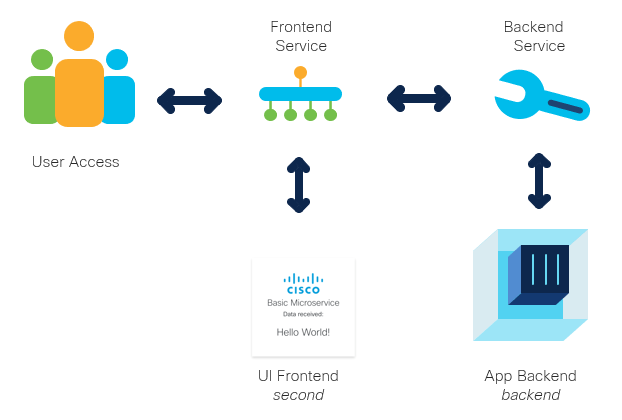

# Basic Microservices

This is the source code for a basic microservice application. It runs a backend and frontend
server on Flask. The frontend requests info from the backend using a GET and JSON. Both
are containerised and ready to deploy with a Kubernetes deployment.yaml and Skaffolw.

### High Level Design


## Contacts

* Josh Ingeniero (jingenie@cisco.com)


## Solution Components
* Python
* Flask
* Docker
* Kubernetes
* Skaffold

## Installation:

#### Clone the repo
```console
git clone https://www.github.com/joshingeniero/microservices-basic
```
#### Setup Docker Desktop
Download and install Docker Desktop for your platform [here](https://www.docker.com/products/docker-desktop).
Afterwards, enable the Kubernetes cluster [here](https://docs.docker.com/desktop/kubernetes/).

##### Install Skaffold
Download and install Skaffold for your platform [here](https://skaffold.dev/docs/install/).


## Setup:


#### Server Customisation:
You may change the data and routes that the backend and frontend servers communicate with
in the app.py files in either the [frontend](second) or [backend](backend) folders
##### Frontend [app.py](second/app.py)
```python
@app.route('/')
def intro():
    url = "http://backend-service:6002/"
    response = requests.get(url)
    info = response.json()["info"]
    return render_template('index.html', data=info, title='Hello!')


@app.route('/info')
def info():
    url = "http://backend-service:6002/info"
    response = requests.get(url)
    return response.json()["info"]


@app.route('/cake')
def cake():
    url = "http://backend-service:6002/maker"
    response = requests.get(url)
    info = response.json()["info"]
    return render_template('index.html', data=info, title='Basic Microservice')
```
##### Backend [app.py](backend/app.py)
```python
@app.route('/')
def hello_world():
    return jsonify({'info': 'Hello from Kubernetes!'})


@app.route('/info')
def info():
    return jsonify({'info': 'chaos'})


@app.route('/maker')
def maker():
    return jsonify({'info': 'The cake is NOT a lie!'})
```


## Usage:

### Skaffold
Run the deployment once for testing
```
$ skaffold run
```

Run the deployment continuously for developing
```
$ skaffold dev
```


## License
Provided under Cisco Sample Code License, for details see [LICENSE](./LICENSE.md)

## Code of Conduct
Our code of conduct is available [here](./CODE_OF_CONDUCT.md)

## Contributing
See our contributing guidelines [here](./CONTRIBUTING.md)


#### DISCLAIMER:
<b>Please note:</b> This script is meant for demo purposes only. All tools/ scripts in this repo are released for use "AS IS" without any warranties of any kind, including, but not limited to their installation, use, or performance. Any use of these scripts and tools is at your own risk. There is no guarantee that they have been through thorough testing in a comparable environment and we are not responsible for any damage or data loss incurred with their use.
You are responsible for reviewing and testing any scripts you run thoroughly before use in any non-testing environment.